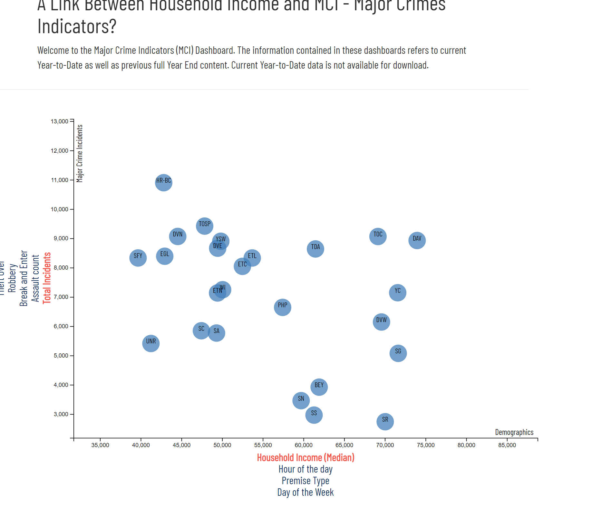

# Data Journalism and D3

In this Data Driven Document (D3), I have explored certain associations between demographics and behavioral risk factors using survey data collected from the American Community Survey (ACS) and the Behavioral Risk Factor Surveillance System (BRFSS) during the year 2014. Each marker represents an individual state in The USA. 

This document was created using D3, the JavaScript library for visualizing data with HTML, SVG, and CSS.

I have also deployed this document as a web application at the following link : https://quiet-crag-45784.herokuapp.com/

#### Images from the final app

